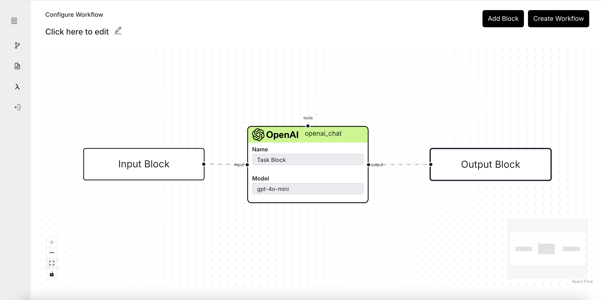

<div>
    <h2 align="center">otto-m8</h2>
    <p align="center">A Flowchart based automation platform to run deep learning workloads with minimal to no code.</p>
    <p>otto-m8 (auto-mate) lets users spin up a wide range of AI models, starting from Traditional deep learning models to large language models, all through a flowchart like user interface. Beyond just a AI platform, otto-m8 will allow users to connect their AI workflow to third party integrations.</p>
    
</div>


### Getting Started
1. Run the following command to make `run.sh` executable
```bash
chmod +x run.sh
```
2. Then launch the application:
```bash
./run.sh
```