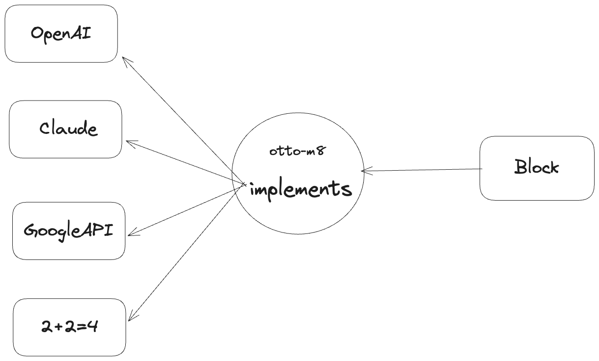
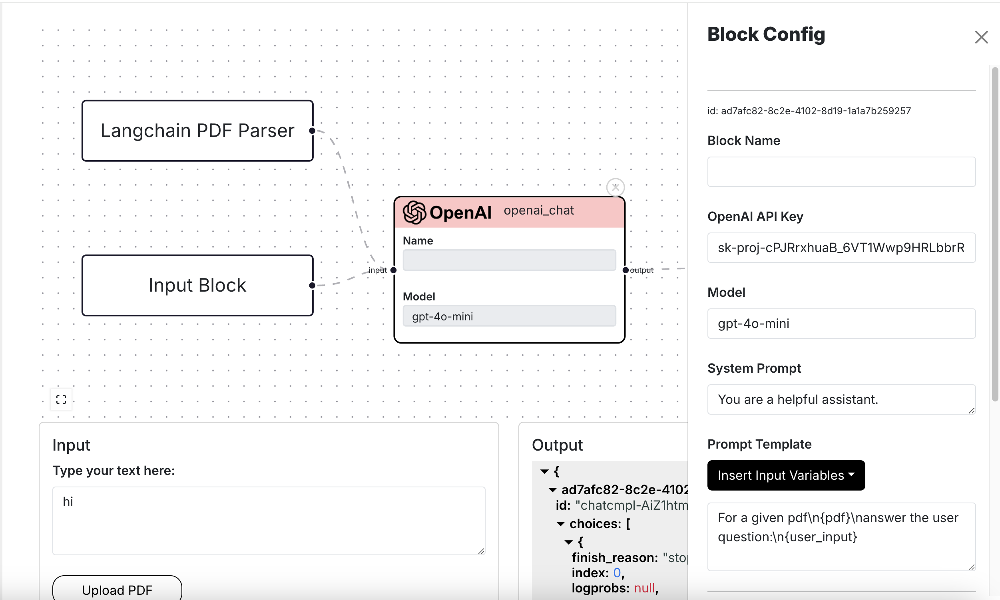

## Implementations - a deeper dive by example

In otto-m8, a block is essentially an implementation of some software program. This software program
can be AI/ML implementations or third party API integrations. To enable developers to build a block, you
write an implementation of something you want to integrate into otto-m8. So let's take the OpenAI block for example
whose implementation would look as follows:

```python
from openai import OpenAI
from implementations.base import (
    BaseImplementation,
    BlockMetadata,
    Field,
    FieldType
)
from other_imports import *


class OpenAIChat(BaseImplementation):
    """Task definition of the OpenAI Chat Completion."""
    display_name = 'OpenAI Chat Completion'
    block_type = 'process'
    block_metadata = BlockMetadata([
        Field(
            name="model", 
            display_name="Model", 
            is_run_config=True, 
            default_value='gpt-4o-mini'
        ),
        Field(
            name="openai_api_key", 
            display_name="OpenAI API Key", 
            is_run_config=True, 
            show_in_ui=False, 
            type=FieldType.PASSWORD.value
        ),
        Field(
            name="system", 
            display_name="System Prompt", 
            is_run_config=True, 
            show_in_ui=False, 
            type=FieldType.TEXTAREA.value
        ),
        Field(
            name="prompt_template", 
            display_name="Prompt Template", 
            is_run_config=True, 
            show_in_ui=False, 
            type=FieldType.PROMPT_TEMPLATE.value
        ),
    ])
    
    def __init__(self, run_config:dict) -> None:
        super().__init__()
        self.run_config = run_config
        self.openAI_client = OpenAI(
            api_key=self.run_config.get('openai_api_key'),
        ) 
        self.others = [...]
    
    def run(self, input_:dict) -> dict:
        # logic for running open ai chat completion
        pass
```

which should render the following on the dashboard:



As you'll notice in the `Fields` within `BlockMetadata`, anything where `is_run_config==True` is rendered on the block configuration sidebar. And
similarly for anything `show_in_ui==True` shows up on the Reactflow node

To break things down, an implementation would generally be made of the following:

- `display_name`: This is the name that will show up on the sidebar when selecting a block.
- `block_type`: This indicates whether a block is of type input, process or output.
- `block_metadata`: The block metadata is made up of all the data that each block will possess, including data that will be
considered part of run configuration, data that will be displayed on the Reactflow node(the Block) itself, and other data that the dashboard
will need.

### `Block Metadata`

```python
from typing import List
from core.blocks.field import Field

class BlockMetadata:
    """BlockMetadata groups together the fields of a block. This helps an Implementation
    class to define the fields that are visible in the block's UI,
    the fields that are visible in the block's sidebar, and generating the initial
    state of the Block(Reactflow nodes).
    """
    def __init__(self, fields:List[Field]) -> None:
        default_fields = [
            Field(name="custom_name", display_name="Block Name"),
            Field(name="source_code", display_name="View Code", is_run_config=False, show_in_ui=False),
            Field(name="source_path", display_name=None, is_run_config=False, show_in_ui=False),
            Field(name="source_hash", display_name=None, is_run_config=False, show_in_ui=False),
            Field(name="process_type", display_name=None, is_run_config=False, show_in_ui=False),
            Field(name="core_block_type", display_name=None, is_run_config=False, show_in_ui=False),
        ]
        """Default fields that are common across all blocks"""
        
        self.fields = [*default_fields, *fields]
```

### `Field`

```python
from enum import Enum
from typing import List, Union, Any, Dict
from pydantic import BaseModel

class Field(BaseModel):
    """Base representation of a field in a block. These are used by
    users to configure a block or see the block's configuration in the block.
    """
    name: str
    """Name of the field used for programatic access to the block's metadata"""
    display_name: Union[str, None] = None
    """The text that will be displayed on the UI to represent the block's metadata"""
    default_value: Any = ''
    """Default value the field will hold"""
    type:str = FieldType.TEXT.value
    """The type of field rendered"""
    dropdown_options: List[Dict] = []
    """This holds value for when `Field.type == STATIC_DROPDOWN`"""
    is_run_config: bool = True
    """Flag to determine whether the field is configurable by the user, or part of the `run_config`"""
    show_in_ui: bool = True
    """Flag to determine whether this field will be rendered on the Reactflow node"""
```

### `FieldType`

```python
class FieldType(Enum):
    # Primitive html data types
    TEXT = 'text'
    PASSWORD = 'password'
    TEXTAREA = 'textarea'
    # Otto-m8 data types. Each type has its own component
    STATIC_DROPDOWN = 'static_dropdown'
    LAMBDAS_DROPDOWN = 'lambdas_dropdown'
    TOOL_LIST = 'tool_list'
    PROMPT_TEMPLATE = 'prompt_template'
    MULTIMODAL_SELECTOR = 'multimodal_selector'
```