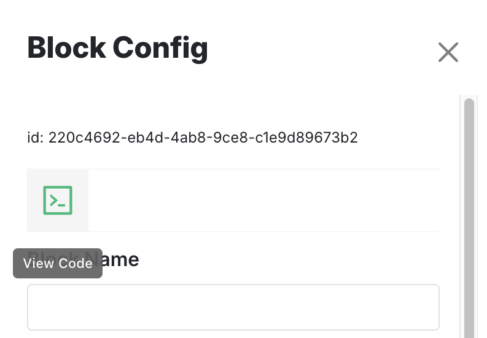
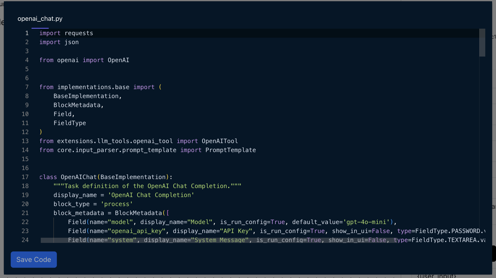

In otto-m8, you are not limited to the built-in implementations that come out-of-the-box. Since a block's
use case can vary from person to person, and use case to use case, you are able to:

1. Alter and customize the code for a built-in block.
2. Create your own block via code.

This feature would enable users to achieve a few things:
- Users are not tied to the platform's block code offerring which could often feel limiting when expanding use cases.
- Custom blocks created from scratch can serve as a way to write logic for LLM tool calling.


## Alter Existing Blocks

As seen in the previous [section](/docs/conceptual-guide/blocks/Blocks–Advanced), code written for an implementation determines
what gets rendered on the screen. This also allows us to change that code to our liking. To alter a block's code simply click on
the View Code icon in the block's configuration sidebar as shown here:



This will open up a code editor that will render your block's code:



From here on, you can add/remove the `Field`'s from the `BlockMetadata`, or change how `run()` processes an input to your liking, and hit
Save Code. On Save, a confirmation window will that will prompt you to set the name of the file you want it saved as, which you can keep as is, or name
a file to your liking. Upon confirmation, the new block will be created in the backend under the `implementations/custom/blocks` directory. We
create the custom block in that directory so that any changes to built-in blocks are not overwritten. Theoretically, you can open up VScode and modify
the code directly but by providing the option to alter a block's code from the UI itself aims to reduce the friction of going back and forth between
the dashboard and the codebase.

## Adding your own custom logic

Otto-m8 has a block called `CustomBlock`, which gives you the ability to make blocks with your own logic embedded in it. To write your own Custom Block,
simply select that option from the add block sidebar, and click on View Code. You will see something like this:

```python
import json
from implementations.base import (
    BaseImplementation,
    BlockMetadata,
    Field,
    FieldType
    # See previous section for more details of available imports
)

class CustomBlock(BaseImplementation):
    display_name = "Custom Block" # Write a display name that will show up on the add block sidebar.
    block_type = 'process' # This will determine whether the block will be of type input, process or output
    block_metadata = BlockMetadata([]) # The block metadata will dictate what will get rendered on the block config sidebar.
    
    def __init__(self, run_config:dict=None) -> None:
        super().__init__()
        
    def run(self, input_:dict=None):
        # Write your logic here
        # return 2+2 or return "hello world" or return UniverseOfPossibilities
        return input_
```

For a guide on `BlockMetadata` see the API reference [here](/docs/conceptual-guide/blocks/Blocks–Advanced#block-metadata).

:::warning Error in code could break the server

When writing custom code, make sure that your code is free of errors, i.e Syntax errors, Import errors, etc. At the moment
the editor is static but in a future version we plan to use a language server to mitigate this issue. If an error is introduced,
often you'll see the error in the server logs, or if you click on add node sidebar, you'll see the display name showing up as
the file name you saved your code with(in all upper case seperated by underscores) instead of the display name you set in your 
code.

:::

### When to use this
1. You can write a custom block when you feel like a block is missing something that should've been there. Few instances that
are missing now include a Memory block and a Retriever block for implementing a RAG agent.
2. This block can be used to define a Tool that an LLM can call.