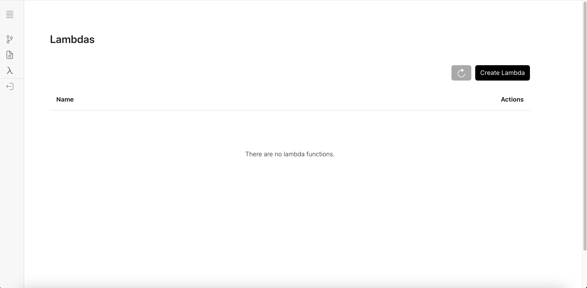

Lambdas is an experimental feature, inspired by AWS Lambdas, to launch serverless functions. This is
another way to allow users to write custom code. A Lambda function looks as follows:

```python
def handler(event:dict, context):
    pass
```

Here `event` is a dictionary that contains a payload that can be used to get data. To use a Lambda function
in the workflow setting:
1. Create a lambda function from the Lambdas page by clicking Create Lambda
    

    A modal will pop up where you can write your Lambda function. If another block in the workflow sends a data to
    the lambda function, you can access that via:


    ```python title="lib/otto_backend/lambdas/handler.py"
    def handler(event:dict, context):
        incoming_block_data = event.get("data")
        # Do something with the incoming block_data
    ```

    > `event.get("data")` is used to access an incoming block's data because of how the Lambda Block is implemented.

    ```python title="lib/otto_backend/implementations/integrations/lambda_function/lambda_function.py" showLineNumbers
        import requests
        import json

        from implementations.base import (
            BaseImplementation,
            BlockMetadata,
            Field,
            FieldType
        )
        from core.input_parser.integration_inp_parser import BasicIntegrationInputParser

        class LambdaFunction(BaseImplementation):
            ...
            
            def __init__(self, run_config: dict) -> None:
                self.run_config = run_config
                self.function_name = self.run_config.get('lambda_function_name')
                self.deployment_url = self.get_lambda_function()
                
            def run(self, input_ = None):
                parse_input = BasicIntegrationInputParser(input_)
                # TODO: By json.loads here, we are assuming that the input is json. Can we enforce that via some data structure?
                data = {"data" : parse_input()}
                payload = {
                    "event": data,
                    "context": {
                        "run_config": self.run_config
                    }
                }
                response = requests.request(
                    method='POST',
                    url=self.deployment_url,
                    json=payload
                )
                if response.status_code != 200:
                    raise Exception(response.text)
                return response.json()
            
            def get_lambda_function(self):
                ...
                return url

    ```


    > **Please Note**: At the moment only one block can be connected to a Lambda block. In order to change that you may want to create a custom Lambda block and change lines 21-23.
2. Create a new workflow, and select the Lambda Function from the Add Block sidebar. Select the Lambda function that
you deployed or want to use. Then, connect a block that you want its data passed onto the Lambda function for processing.


## Under the hood

When you create a lambda function, under the hood, we are creating a docker container that mounts the `lib/otto_backend/lambdas`
directory on the container, and then writes to the `handler.py` file. This handler.py file is then referenced in a FastAPI server in
`lib/otto_backend/lambdas/server.py` which lets you interact with the Lambda function.

The ideal use case for the Lambda function would be to launch seperate docker containers (by separate we mean separate from any workflow
containers).