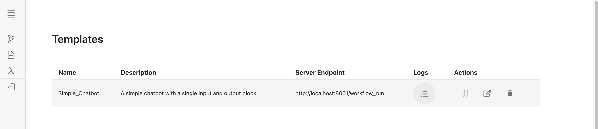

Every interaction that the user has with a deployed workflow gets logged into a table by the Tracer.

For a simple workflow, where there is only 1 input, process and output block, a tracer doesn't add much. 
However, when there are multiple stages of process blocks, the user would only see the output of the last
block, and therefore the tracer would allow the user to inspect the input and output of every block in 
the workflow.